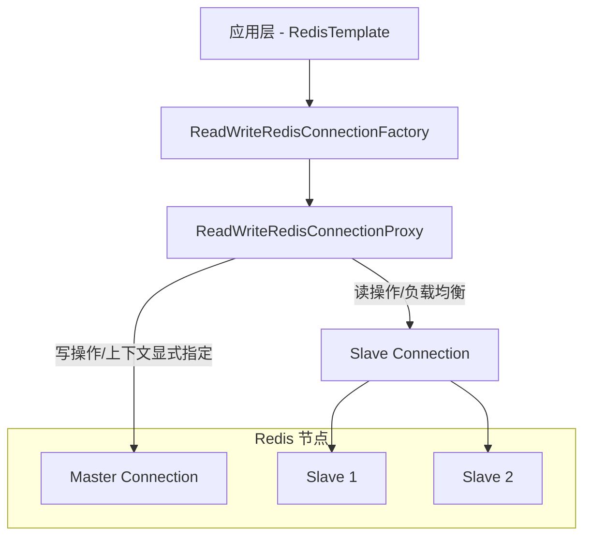
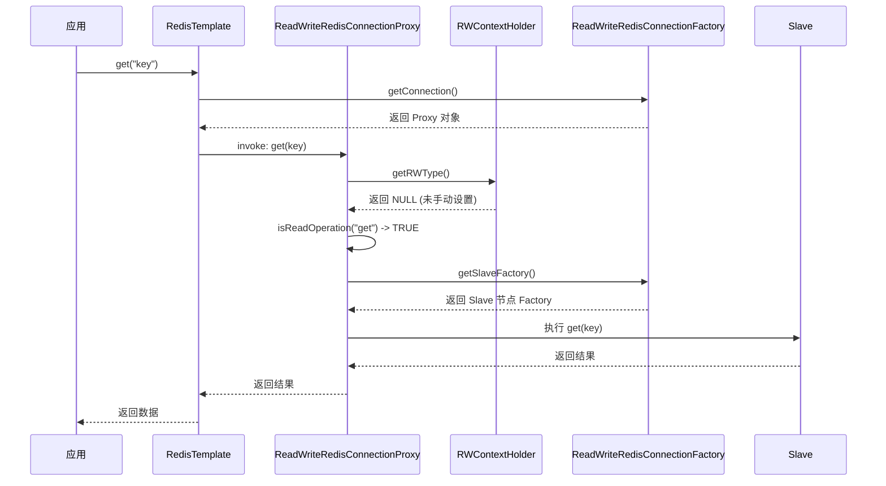

# Redis Read/Write Splitting SDK Starter

A Spring Boot Starter for automatic Redis Read/Write splitting. It routes write operations to a master Redis instance and read operations to multiple slave instances with load balancing.

## Features
- **Automatic Routing**: Automatically identifies read/write operations based on command names.
- **Manual Override**: ThreadLocal context to force routing to master or slaves.
- **Load Balancing**: Round-robin load balancing across multiple slave instances.
- **Zero Configuration**: Fully integrated with Spring Boot Auto-configuration.
- **Extensible**: Built using Proxy and Factory patterns.

## Installation
Add the dependency to your `pom.xml` (after building locally):

```xml
<dependency>
    <groupId>com.example</groupId>
    <artifactId>redis-rw-split-sdk-starter</artifactId>
    <version>1.0.0</version>
</dependency>
```

## Configuration
Add the following to your `application.yml`:

```yaml
spring:
  redis:
    rw:
      enabled: true
      master:
        host: localhost
        port: 6379
        database: 0
      slaves:
        - host: localhost
          port: 6380
          database: 0
        - host: localhost
          port: 6381
          database: 0
```

## Usage

### Automatic Routing
Standard `RedisTemplate` or `StringRedisTemplate` will automatically route commands:

```java
@Autowired
private StringRedisTemplate redisTemplate;

public void demo() {
    // Routes to Master
    redisTemplate.opsForValue().set("key", "value");
    
    // Routes to Slaves (Round-robin)
    String val = redisTemplate.opsForValue().get("key");
}
```

### Manual Routing Override
Use `RWContextHolder` to manually specify routing:

```java
try {
    RWContextHolder.setRWType(RWType.WRITE);
    // This GET will be routed to Master instead of Slaves
    String val = redisTemplate.opsForValue().get("key");
} finally {
    RWContextHolder.clear();
}
```

## 设计方案 (Detailed Design)

### 1. 核心架构图



### 2. 核心组件说明

- **`ReadWriteRedisConnectionFactory`**: 实现 `RedisConnectionFactory` 接口，作为 Spring RedisTemplate 的连接工厂。它持有主节点和从节点的多个连接工厂实例。
- **`ReadWriteRedisConnectionProxy`**: 核心逻辑实现类，使用 JDK 动态代理拦截 `RedisConnection`。它根据当前操作的类型（读/写）或 ThreadLocal 上下文动态选择真实的底层连接。
- **`RWContextHolder`**: 使用 `ThreadLocal` 存储读写标记，允许用户手动强制指定路由。
- **`RedisRWAutoConfiguration`**: Spring Boot 自动配置类，负责初始化连接工厂并注册为主 Bean。

### 3. 读写判定逻辑

路由决策由 `ReadWriteRedisConnectionProxy` 负责，优先级如下：

1. **显式指定**: 如果 `RWContextHolder` 中设置了 `RWType`（READ 或 WRITE），则直接按此路由。
2. **隐式判定**: 如果未显式指定，根据调用的方法名进行前缀匹配：
   - **读操作前缀**: `get`, `mGet`, `exists`, `ttl`, `pTtl`, `type`, `keys`, `scan`, `randomKey`, `hGet`, `hMGet`, `hGetAll`, `hKeys`, `hVals`, `hLen`, `hExists`, `hScan`, `lIndex`, `lLen`, `lRange`, `sMembers`, `sIsMember`, `sCard`, `sScan`, `zRange` 等。
   - **写操作**: 凡是不匹配上述读前缀的方法均视为写操作。

### 4. 负载均衡实现

从节点的负载均衡在 `ReadWriteRedisConnectionFactory#getSlaveFactory` 中实现，采用了简单的 **Round Robin (轮询)** 算法。

### 5. 交互时序图

以下是应用发起 Redis 请求时的时序逻辑：



## 扩展性考虑
1. **多协议支持**: 目前基于 Lettuce 封装，未来可通过配置支持 Jedis。
2. **健康检查**: 计划增加对从节点的健康检查，自动摘除宕机节点。
3. **注解支持**: 计划增加 `@Read` 和 `@Write` 注解，通过 AOP 自动设置 `RWContextHolder`。
