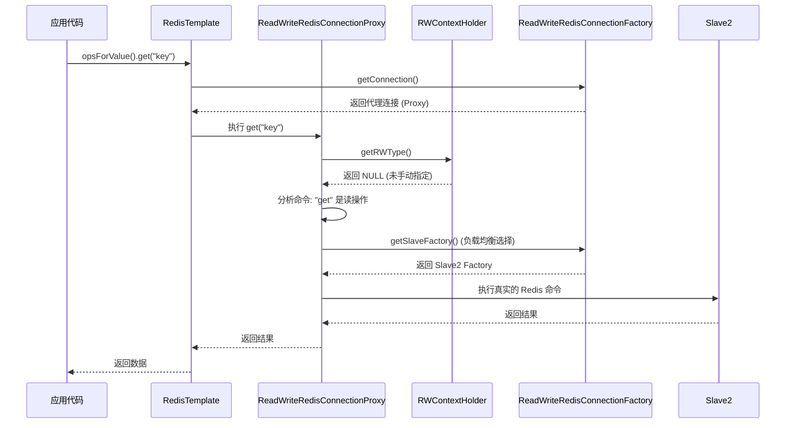

# Redis 读写分离 Spring Boot Starter

这是一个专为高性能场景设计的 Redis 读写分离 Spring Boot 组件。它能够自动将写操作路由到主节点（Master），将读操作负载均衡地路由到多个从节点（Slaves），并针对 **JDK 21 虚拟线程** 和 **极高并发场景** 进行了深度优化。

## ✨ 核心特性
- **自动路由判定**：基于 Redis 命令前缀自动识别读写操作，无需手动干预。
- **手动路由控制**：通过 `RWContextHolder` 手动强制指定读写链路（虚拟线程友好）。
- **高并发极致优化**：采用 **无锁（Lock-Free）** 负载均衡算法，消除超高并发下的 CAS 竞争。
- **JDK 21+ 完美适配**：全面支持 **虚拟线程（Virtual Threads）**，内存占用极低，预留 `ScopedValue` 接口。
- **零侵入设计**：完全集成 Spring Boot 自动配置，直接注入 `RedisTemplate` 即可使用。

## 🚀 性能亮点 (JDK 21 & 高并发)
1. **无锁负载均衡**：使用 `ThreadLocalRandom` 代替 `AtomicInteger` 进行从库选择，随着 CPU 核心数增加，吞吐量近乎线性增长。
2. **虚拟线程安全**：`RWContextHolder` 针对虚拟线程生命周期优化，防止在数百万计的虚拟线程环境下产生内存泄漏。
3. **安全降级策略**：当上下文丢失（如跨线程切换）时，默认路由至主库（WRITE），确保数据强一致性。

## 📦 安装说明
在 `pom.xml` 中引入依赖：

```xml
<dependency>
    <groupId>com.example</groupId>
    <artifactId>redis-rw-split-sdk-starter</artifactId>
    <version>1.0.0</version>
</dependency>
```

## ⚙️ 配置参考
在 `application.yml` 中配置主从节点：

```yaml
spring:
  redis:
    rw:
      enabled: true
      master:
        host: localhost
        port: 6379
      slaves:
        - host: 192.168.1.10
          port: 6379
        - host: 192.168.1.11
          port: 6379
```

---

## 🛠️ 设计原理

### 1. 核心架构
本 SDK 基于 **工厂模式** 和 **代理模式** 实现：

- **`ReadWriteRedisConnectionFactory`**: 包装类，持有主从多个真实的 `LettuceConnectionFactory`。
- **`ReadWriteRedisConnectionProxy`**: 核心逻辑，通过 JDK 动态代理拦截 `RedisConnection` 的所有方法调用。

### 2. 路由决策逻辑
每次 Redis 操作都会经过以下决策树：

1. **显式上下文 (Explicit Context)**：优先检查 `RWContextHolder` 中是否手动设置了 `READ` 或 `WRITE`。
2. **命令分析 (Command Analysis)**：若无手动设置，分析 Redis 命令名（如 `GET`, `HGET` -> 读；`SET`, `DEL` -> 写）。
3. **安全兜底 (Safe Fallback)**：若无法判定，默认路由至主库（MASTER），防止数据丢失。

### 3. 无锁负载均衡实现
传统的轮询算法通常使用 `AtomicInteger.getAndIncrement()`，但在极高并发下，多个线程争抢同一个缓存行（Cache Line）会导致严重的 CAS 失败和总线锁开销。
本项目采用：
```java
// 使用 ThreadLocalRandom 消除线程间竞争
int index = ThreadLocalRandom.current().nextInt(slaveCount);
return slaveFactories.get(index);
```

---

## 📊 交互时序图

以下是应用发起一个 `GET` 请求时的处理流程：



---

## 💡 使用示例

### 自动路由
```java
@Autowired
private StringRedisTemplate redisTemplate;

public void demo() {
    // 自动路由到主库 (写操作)
    redisTemplate.opsForValue().set("user:1", "Alice");
    
    // 自动路由到从库 (读操作，负载均衡)
    String val = redisTemplate.opsForValue().get("user:1");
}
```

### 手动强制路由
在需要“写后立即读”的场景，可以通过显式上下文强制读取主库：
```java
try {
    RWContextHolder.setRWType(RWType.WRITE); // 强制路由到主库
    String val = redisTemplate.opsForValue().get("user:1");
} finally {
    RWContextHolder.clear(); // 务必清理上下文
}
```

---

## 🧪 压力测试
SDK 内置了模拟 2000+ 并发任务的压力测试类，支持自动识别 JDK 21 虚拟线程：

```bash
mvn test -Dtest=RedisRWHighConcurrencyTest
```

## 🛣️ 路线图
- [ ] **AOP 注解支持**：提供 `@Read` 和 `@Write` 注解。
- [ ] **健康检查**：自动剔除宕机的从节点。
- [ ] **JDK 21 ScopedValue 深度集成**：在 JDK 21 环境下彻底取代 ThreadLocal。
